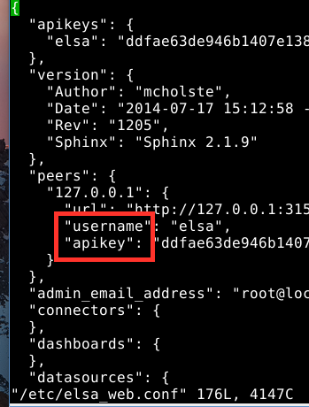
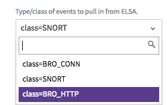
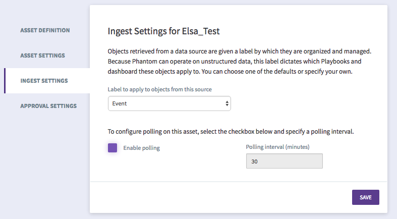
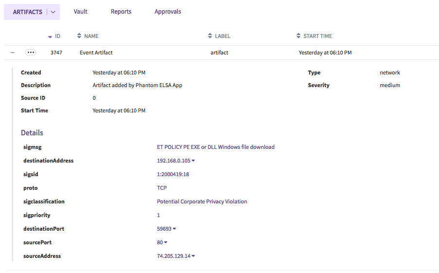
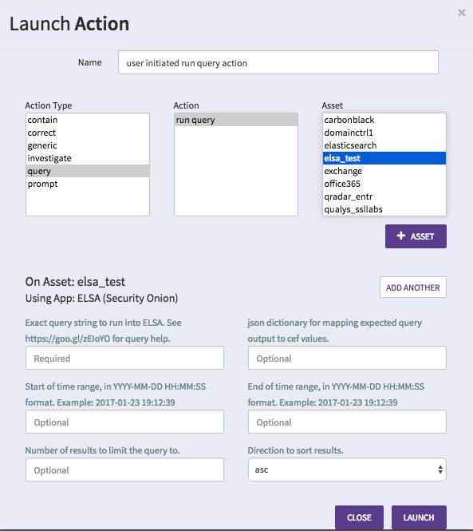

[comment]: # "Auto-generated SOAR connector documentation"
# ELSA (Security Onion)

Publisher: Phantom  
Connector Version: 1.0.18  
Product Vendor: Security Onion  
Product Name: ELSA  
Product Version Supported (regex): ".\*"  
Minimum Product Version: 6.2.1  

This app integrates with the ELSA service included in the Security Onion security distribution

[comment]: # "File: README.md"
[comment]: # "Copyright (c) 2018 Splunk Inc."
[comment]: # ""
[comment]: # "Licensed under the Apache License, Version 2.0 (the 'License');"
[comment]: # "you may not use this file except in compliance with the License."
[comment]: # "You may obtain a copy of the License at"
[comment]: # ""
[comment]: # "    http://www.apache.org/licenses/LICENSE-2.0"
[comment]: # ""
[comment]: # "Unless required by applicable law or agreed to in writing, software distributed under"
[comment]: # "the License is distributed on an 'AS IS' BASIS, WITHOUT WARRANTIES OR CONDITIONS OF ANY KIND,"
[comment]: # "either express or implied. See the License for the specific language governing permissions"
[comment]: # "and limitations under the License."
[comment]: # ""
Security Onion is a popular Linux distribution pre-loaded with numerous Network Security Monitoring
tools such as Snort, Bro, and Suricata. Security Onion uses ELSA (Enterprise Log Search and Archive)
to store all the IDS alerts from Snort, Bro and Suricata. This app collects the events and event
details from ELSA into Phantom containers and artifacts.

First, create an ELSA asset in Phantom and supply the Device URL, the User name and the Apikey. The
User name and ApiKey are found in the /etc/elsa_web.conf file on the Security Onion machine. You
will need to have root privileges to access this file. See the below screenshot for an example of
the /etc/elsa_web.conf file that you are looking for.  

You will also need to the set the "event type" you want to pull in from ELSA. Currently, three basic
queries are supported as shown below.  

The other values can be left in the default state for now.

Select a label for the containers that this asset will create. Either pick from the existing list,
or select **New Entry** and type a new label. In this screenshot we are using **Event** :

Once the asset is saved, run Test Connectivity and make sure it passes. The Test Connectivity action
attempts to validate the User name and the ApiKey that the user has provided by connecting to the
configured Device URL. The connection is tested by running a basic query and checking that the HTTP
response is valid.

## Containers created

The app will create a single container for each event that it ingests with a single artifact called
Event Artifact.

## Event Artifact

The details regarding the event that are acquired from the API call to ELSA will be collected and
the data that are related to the type of event are all stored into the CEF fields and are added to
the artifact. There are some default CEF field mappings in the app for Snort and BRO_CONN and
BRO_HTTP event types. The fields that are present in the artifact greatly depend upon the type of
the event that was created. Different events will have different types of values in the artifacts.  
  

## Run Query

Finally, there is a "run query" action that enables the user to run a query in ELSA either as a
manual action or as a chained action in a playbook in order to gather more data. This action allows
the user to fill in the details for the exact query string to run. This can be as simple as an IP
address or use the ELSA query language to get back more specific information. For information, click
[here](https://github.com/Security-Onion-Solutions/security-onion/wiki/ELSAQueryTips) for some tips
on what to use for query strings in ELSA. The action also takes a JSON formatted "cef_map" parameter
that allows the user to properly map the fields they expect to the proper CEF field so the output
results can be used to further chain actions in a playbook. The following is an example "cef_map"
parameter:

                {"program": "deviceEventCategory", "dstport": "destinationPort", "dstip": "destinationAddress", "srcip": "sourceAddress", "srcport": "sourcePort", "site": "destinationDnsName", "uri": "requestURL", "bytesout": "bytesOut"}
            

The other parameters are fairly self-explanatory.  
  

### Configuration Variables
The below configuration variables are required for this Connector to operate.  These variables are specified when configuring a ELSA asset in SOAR.

VARIABLE | REQUIRED | TYPE | DESCRIPTION
-------- | -------- | ---- | -----------
**base_url** |  required  | string | Device URL, e.g. https://security-onion.local OR https://192.168.100.100
**verify_server_cert** |  required  | boolean | Verify server certificate
**username** |  required  | string | User name corresponding to the api key (found in /etc/elsa_web.conf file on Security Onion machine)
**apikey** |  required  | password | Apikey for username (found in /etc/elsa_web.conf file on Security Onion machine)
**query_type** |  required  | string | Type/class of events to pull in from ELSA.
**max_containers** |  required  | numeric | Maximum events for scheduled polling
**first_run_max_events** |  required  | numeric | Maximum events to poll first time
**poll_hours** |  optional  | numeric | Ingest events in last N hours (POLL NOW and First Run)
**query_timeout** |  optional  | numeric | Max Time to wait for query to finish (seconds)
**timezone** |  required  | timezone | Timezone configured on device

### Supported Actions  
[test connectivity](#action-test-connectivity) - Validate the asset configuration for connectivity  
[on poll](#action-on-poll) - Callback action for the on_poll ingest functionality  
[run query](#action-run-query) - Run a query against ELSA  

## action: 'test connectivity'
Validate the asset configuration for connectivity

Type: **test**  
Read only: **True**

#### Action Parameters
No parameters are required for this action

#### Action Output
No Output  

## action: 'on poll'
Callback action for the on_poll ingest functionality

Type: **ingest**  
Read only: **True**

#### Action Parameters
PARAMETER | REQUIRED | DESCRIPTION | TYPE | CONTAINS
--------- | -------- | ----------- | ---- | --------
**container_id** |  optional  | Container IDs to limit the ingestion to. | string | 
**start_time** |  optional  | Start of time range, in epoch time (milliseconds) | numeric | 
**end_time** |  optional  | End of time range, in epoch time (milliseconds) | numeric | 
**container_count** |  optional  | Maximum number of container records to query for. | numeric | 
**artifact_count** |  optional  | Maximum number of artifact records to query for. | numeric | 

#### Action Output
No Output  

## action: 'run query'
Run a query against ELSA

Type: **investigate**  
Read only: **True**

#### Action Parameters
PARAMETER | REQUIRED | DESCRIPTION | TYPE | CONTAINS
--------- | -------- | ----------- | ---- | --------
**query_string** |  required  | Exact query string to run into ELSA. See https://goo.gl/zEIoYO for query help. | string | 
**output_cef_map** |  optional  | json dictionary for mapping expected query output to cef values. | string | 
**start_time** |  optional  | Start of time range, in YYYY-MM-DD HH:MM:SS format.  Example: 2017-01-23 19:12:39 | string | 
**end_time** |  optional  | End of time range, in YYYY-MM-DD HH:MM:SS format.  Example: 2017-01-23 19:12:39 | string | 
**limit** |  optional  | Number of results to limit the query to. | numeric | 
**orderby_dir** |  optional  | Direction to sort results. | string | 

#### Action Output
DATA PATH | TYPE | CONTAINS | EXAMPLE VALUES
--------- | ---- | -------- | --------------
action_result.data.\*.cef.\*.method | string |  |   GET 
action_result.data.\*.cef.\*.useragent | string |  |   Mozilla/5.0 (Macintosh; Intel Mac OS X 10_12_6) AppleWebKit/537.36 (KHTML, like Gecko) Chrome/62.0.3202.94 Safari/537.36 
action_result.data.\*.cef.\*.requestURL | string |  |   /dt?advEntityId=117806&asId=e967f178-639f-8d64-68f6-2694d9253fb1&tv={c:w25NpP,pingTime:-2,time:149,type:a,sca:{avgrn1:0,dfp:{df:4,sz:640.360,dom:div}},env:{sf:0,pom:1},vv:3.5.0,rt:1,cb:0,th:0,es:0,sa:1,sc:0,ha:1,fif:0,gm:0,slTimes:{i:0,o:149,n:0,pp:0,pm:0 
action_result.data.\*.cef.\*.sourcePort | string |  `port`  |   60344 
action_result.data.\*.cef.\*.statuscode | string |  |   200 
action_result.data.\*.cef.\*.sourceAddress | string |  `ip`  |   192.168.1.3 
action_result.data.\*.cef.\*.destinationPort | string |  `port`  |   80 
action_result.data.\*.cef.\*.destinationAddress | string |  `ip`  |   69.172.216.111 
action_result.data.\*.cef.\*.destinationDnsName | string |  `domain`  |   dt.adsafeprotected.com 
action_result.data.\*.cef.\*.proto | string |  |   TCP 
action_result.data.\*.cef.\*.sigmsg | string |  |  
action_result.data.\*.cef.\*.sigsid | string |  |  
action_result.data.\*.cef.\*.sigpriority | string |  |  
action_result.data.\*.cef.\*.sigclassification | string |  |  
action_result.data.\*.cef.\*.mimetype | string |  |   image/gif 
action_result.data.\*.cef.\*.contentlength | string |  |   43 
action_result.data.\*.cef.\*.pktsin | string |  |   2 
action_result.data.\*.cef.\*.bytesin | string |  |   53 
action_result.data.\*.cef.\*.pktsout | string |  |   2 
action_result.data.\*.cef.\*.service | string |  |  
action_result.data.\*.cef.\*.bytesOut | string |  |   101 
action_result.data.\*.cef.\*.connduration | string |  |   0.004203 
action_result.data.\*.cef.\*.respcountrycode | string |  |   US 
action_result.data.\*.cef.\*.md5 | string |  |  
action_result.data.\*.cef.\*.sha1 | string |  |  
action_result.data.\*.cef.\*.source | string |  |  
action_result.data.\*.cef.\*.rxhosts | string |  |  
action_result.data.\*.cef.\*.txhosts | string |  |  
action_result.data.\*.cef.\*.seenbytes | string |  |  
action_result.data.\*.cef.\*.totalbytes | string |  |  
action_result.status | string |  |   success 
action_result.message | string |  |   Total records: 11, Query id: 601, Records returned: 10 
action_result.summary.query_id | string |  |   601 
action_result.summary.total_records | numeric |  |   11 
action_result.summary.records_returned | numeric |  |   10 
action_result.parameter.limit | string |  |  
action_result.parameter.end_time | string |  |  
action_result.parameter.start_time | string |  |  
action_result.parameter.orderby_dir | string |  |   asc 
action_result.parameter.query_string | string |  |   53 
summary.total_objects | numeric |  |   1 
summary.total_objects_successful | numeric |  |   1 
action_result.data.\*.cef.\*.deviceEventCategory | string |  |   bro_http 
action_result.data.\*.cef.\*.class | string |  |   BRO_HTTP 
action_result.data.\*.cef.\*.host | string |  `ip`  |   127.0.0.1 
action_result.data.\*.cef.\*.referer | string |  `url`  |   http://www.zdnet.com/article/build-your-own-supercomputer-out-of-raspberry-pi-boards/ 
action_result.data.\*.cef.\*.versionminor2 | string |  |   2785 
action_result.data.\*.cef.\*.softwaretype | string |  |   HTTP::BROWSER 
action_result.data.\*.cef.\*.name | string |  |   Chrome 
action_result.data.\*.cef.\*.versionmajor | string |  |   53 
action_result.data.\*.cef.\*.version | string |  |   Mozilla/5.0 (X11; Linux x86_64) AppleWebKit/537.36 (KHTML, like Gecko) Ubuntu Chromium/53.0.2785.143 Chrome/53.0.2785.143 Safari/537.36 
action_result.data.\*.cef.\*.versionminor3 | string |  |   143 
action_result.parameter.output_cef_map | string |  |   {"program": "deviceEventCategory",     "dstport": "destinationPort",     "dstip": "destinationAddress",     "srcip": "sourceAddress",     "srcport": "sourcePort",     "site": "destinationDnsName",     "uri": "requestURL",     "bytesout": "bytesOut"} 